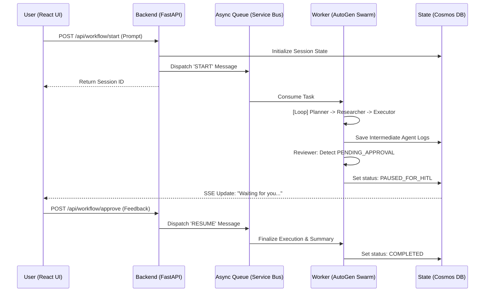

<p align="center">
  
</p>

<h1 align="center">OrchestrAI</h1>

<p align="center">
  <strong>Production-ready Asynchronous Multi-Agent Orchestration Framework</strong>
</p>

<p align="center">
  
  
  
  
  
</p>

<hr />

## 🌟 Vision
**OrchestrAI** is not just another chatbot interface; it's a **digital workforce**. Designed for high-stakes business automation, it decomposes complex user requests into actionable sequences, executes them across multiple tools (Outlook, Web Search, PDF Analysis), and enforces **Human-in-the-Loop (HITL)** safety at every step.

---

## 🛠️ Tech Stack & Infrastructure

- **🖥️ Mission Control (Frontend)**: A sophisticated React dashboard with live execution telemetry, execution graphs, and interactive HITL approval flows.
- **🚀 Neural Gateway (Backend)**: FastAPI serving as a high-performance bridge between the UI and the agent swarm.
- **🧠 Agent Swarm**: Powered by **Microsoft AutoGen (v0.4.x)**, utilizing a tiered model strategy (GPT-4o for planning, Phi-3.5 for execution) to balance cost and intelligence.
- **💾 State Persistence**: Azure Cosmos DB (Serverless) for durable session memory and workflow resumption.
- **📡 Async Pulse**: Azure Service Bus handles job queuing, ensuring zero timeouts for long-running agent reasoning loops.

---

## 🗺️ System Architecture



---

## 👥 The Agent Team

| Agent | Role | Model | Specialization |
| :--- | :--- | :--- | :--- |
| **Planner** | The Architect | `GPT-4o` | Decomposes prompts into precise Pydantic task arrays. |
| **Researcher** | The Investigator | `GPT-4o-mini` | RAG, PageIndex reasoning, and live Web Search. |
| **Executor** | The Operator | `Phi-3.5-mini` | Drafting MS Graph payloads and Python tool execution. |
| **Reviewer** | The Auditor | `GPT-4o-mini` | Quality control and HITL trigger logic. |

---

## 🚀 Quick Start

### 1. Environment Setup
Create a `.env` file in the root directory (refer to `.env.example`).
```bash
# Azure Credentials
SERVICE_BUS_CONNECTION_STRING="..."
COSMOS_CONNECTION_STRING="..."
AZURE_OPENAI_API_KEY="..."

# Tools
BREVO_API_KEY="..."
SERPER_API_KEY="..."
```

### 2. Launch the Backend
```bash
# Terminal 1
python -m uvicorn backend.main:app --reload --port 8000
```

### 3. Launch the Frontend
```bash
# Terminal 2
cd frontend
npm install
npm run dev
```

---

## 🔒 Security & Privacy
- **JWT Authentication**: All endpoints are protected with industry-standard tokens.
- **Data Isolation**: Multi-tenant architecture ensures one user's logs never leak to another.
- **Safety First**: No destructive actions (emails, calendar invites) are sent without your explicit click in the dashboard.

<p align="center">
  <i>Built with ❤️ for AI Unlocked Challenge - Track 4</i>
</p>
